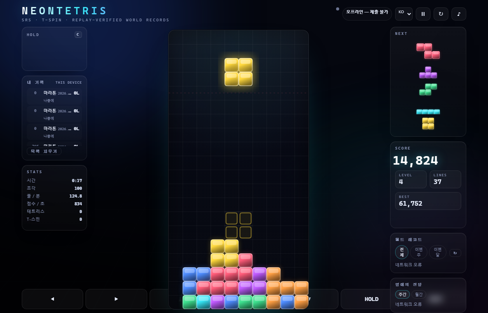
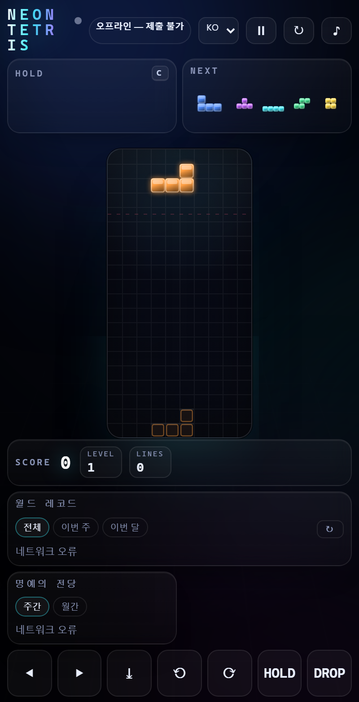

# NEON TETRIS

네온 글래스무디 웹 테트리스 + **리플레이 검증 월드 레코드**.
빌드 없음, 런타임 의존성 없음(Node 내장 모듈만). `index.html`을 더블클릭해도 되고, 서버를 띄우면 기록을 제출해 공유할 수 있다.

```bash
node server/server.js        # → http://localhost:8787   (제출·월드 보드·공유 활성화)
```




## 조작

| 키 | 동작 |
| --- | --- |
| `←` `→` | 이동 (DAS 8틱 / ARR 2틱, 동시 입력은 마지막 입력 우선) |
| `↓` | 소프트 드롭 (칸당 +1점) |
| `Space` | 하드 드롭 (칸당 +2점) |
| `↑` `X` / `Z` / `A` | 시계 / 반시계 / 180° 회전 |
| `C` `Shift` | 홀드 |
| `P` `Esc` | 일시정지 · `R` 재시작 · `M` 소리 |

모바일/태블릿은 화면 아래 터치 바가 뜨고, 레이아웃은 보드 중심으로 재배치된다.

## 모드 / 옵션

| 모드 | 끝나는 조건 | 순위 축 |
| --- | --- | --- |
| MARATHON | 상단 이탈 | 점수 |
| SPRINT 40 | 40줄 달성 | **시간** |
| ULTRA 2:00 | 2분 경과 | 점수 |

시작 레벨(1–20)과 **20G**(중력 없음, 즉시 착지)를 고를 수 있다.

## 특징

- **SRS + 월킥**(가이드라인 원문 테이블, y-up→화면 좌표 변환), 180° 킥(자체 확장), 7-bag, 홀드, 고스트, 락 딜레이 500ms(15회 리셋), **10×40 필드**(보이는 20 + 숨은 20), 줄 삭제 연출
- **T-스핀 판정**(3-corner + 앞면 규칙 + 5번째 킥 만회, MINI 구분) · 가이드라인 스코어링 · B2B ×1.5 · 콤보 · 퍼펙트 클리어
- **규칙 버전(현재 `r4`)을 리플레이에 박아 둔다** — 규칙을 바꾸면 옛 리플레이가 검증 불가능해지므로, 바꿀 수 밖에 없는 상황에 대비한 최소한의 안전장치
- **리플레이 = 시드 + 틱 입력 목록** 몇백 바이트. 영상이 필요 없다.
- **서버 검증 월드 레코드**: 서버가 리플레이를 다시 돌려 점수가 그대로 재현될 때만 발행
- **1위 유지 시간·발행 당시 순위·주/월 챔피언** 같은 "시점" 데이터는 삭제하지 않고 쌓아 둔다 — 그리고 지금은 **명예의 전당** 카드로 화면에도 보인다 (주간/월간 챔피언 + 최장 1위 유지)
- WebAudio 효과음(외부 파일 0), 파티클/화면 흔들림/레벨업 플래시, ko/en/ja/zh UI

## 구조 — 규칙은 한 곳에만 있다

| 파일 | 역할 |
| --- | --- |
| `core.js` | 조각/회전/킥/충돌/T-스핀/스코어링 (순수) |
| `index.html` · `style.css` · `ui.css` | 정적 셸과 스타일(빌드 없음). 서버는 이들을 **허용 목록**으로만 서빙 |
| `engine.js` | **결정론 틱 엔진.** 모든 타이머가 정수 틱(1/60초)이라 같은 시드+입력 = 비트 단위로 같은 결과. 서버 검증의 기반 |
| `replay.js` | 리플레이 코덱(`pack`/`unpack`), 정규화(`canonical`), 재생 커서 |
| `identity.js` | 기기 지문(base32+체크섬), 코드네임 자동 생성, IP 마스킹 (클라임·서버 공용) |
| `i18n.js` | 사전(ko/en/ja/zh) + 엔진 라벨 번역 |
| `client.js` | WebCrypto 키쌍, 세션/제출/서명, 공유·보드·리플레이 UI |
| `game.js` | 틱 루프, 입력→엔진+녹화, 렌더/연출/HUD. **규칙 없음** |
| `server/` | `db.js`(SQLite 스키마·쿼리) `verify.js`(재시뮬+휴리스틱) `queue.js`+`worker.js`(워커 풀) `server.js`(HTTP·정적·API) `config.js`(환경변수·상한) |
| `tools/` | `ai.js`(프리셋 4종 AI) `selftest.js` `verifytest.js` `e2e.js` `review.js`(검수 CLI) `loadtest.js` `shot.js` |
| `probe.js` | 헤드리스 브라우저 게임 검증 |

### 규칙 버전 — 왜 리플레이에 `r4` 가 박혀 있나

엔진은 `RULES_ID`(현재 `r4`) 를 선언하고, 이것을 런 상태·`canonical()`·packed 리플레이·DB 컬럼에까지 찍는다.
이유는 단 하나: **리플레이는 "같은 입력 → 같은 결과" 를 약속하는 문서 같은 것**이고,
점수표·SRS 킥 테이블·T-스핀 판정·락 딜레이 중 하나라도 바뀌면 서버의 재시뮬이 과거 리플레이와
**다른 점수**를 내놓는다. 그 순간 그 리플레이는 영구히 검증 불가능한 유물이 되고, 그건 나중에 되돌릴 방법이 없다.

| 버전 | 규칙 |
| --- | --- |
| `r0` | 서버 도입 전의 로컬 전용 포맷(`NT1`). 점수 규칙은 같지만 스핀 판정 하나가 달랐다 |
| `r1` | SRS+월킥, 3-corner T-스핀(5번째 킥 만회로 full 승격), **회전 이후 아래로 이동하면 스핀 해제** |
| `r2` | **SRS 월킥 세로 부호를 가이드라인 좌표계(y-up)로 정정.** r1 은 원문 값을 화면 좌표에 그대로 적용해 킥의 위/아래가 뒤집혀 있었다 |
| `r3` | **상단 버퍼 4행 + 가이드라인식 끝남 조건**(lock out = 조각이 *전부* 보이는 판 위에 잠길 때, block out = 스폰 막힘), **O 조각 회전 성공**. 보드 해시는 24행 전체 대상 |
| `r4` | **필드를 공식 서술 그대로 10×40 으로** (버퍼 4→20행). r3 은 보이는 판 위 4행에 인위적 천장이 있어 40행 구현과 갈리는 지점이 남았다. 보드 해시는 40행 대상. 같은 커밋에서 **I 킥 변형(`I_KICK_VARIANT`)과 스폰 행(`SPAWN_ROW`)을 이름으로 고정** |

`r1` 에서 바로잡은 것: 하드 드롭을 "먼저 회전한 다음 아래로 떨어뜨리는" 입력으로 쓰는 경우가 있는데,
이때 조각이 실제로 미끄러져 내려갔다면 마지막 동작은 회전이 아니라 **이동**이다.
이전 구현은 회전 플래그를 그대로 유지해서 T-스핀으로 인정했다. 지금은 이동 거리가 0이 아니면 플래그를 내린다
(제자리에서 회전하고 그대로 잠금은 스핀 유지 — 회전 인스냅트 착지와 같은 취급).

`r2` 에서 바로잡은 것: 월킥 테이블은 가이드라인 원문(Tetris Wiki SRS) 값을 그대로 쓰고 있는데, **원문은 y-up(위가 +)** 좌표계다.
엔진은 그 값을 `p.y += dy`(y-down) 로 적용하고 있었기 때문에 세로 킥이 모두 뒤집혀 있었다.
예: `0→R` 4번째 시험은 본래 "2칸 **아래**"인데 "2칸 **위**"로 시도됐다. 그 결과는 단순히 점수가 아니라
**공식 SRS에서 가능한 셋업이 안 되고, 반대로 공식에서는 안 되는 셋업이 되는** 형태다
(실측: 킥이 실제로 필요한 T 회전 46,460회 중 56.6%가 가이드라인과 다른 자리로 착지).
수정은 `kicksFor()` 가 세로 성분을 뒤집어 반환하는 것 하나이고, 180° 킥은 원래부터 자체 설계(공식 SRS에 180° 없음)라 화면 좌표로 둔다.

`r3` 에서 맞춘 것: 공식 놀이필드는 보이는 20행 **위**에 조각이 스폰·정리되는 숨은 버퍼 행이 있고, 끝남 조건은 두 가지다 —
**block out**(스폰자리가 막힘) 과 **lock out**(조각이 *전부* 보이는 판 위에 잠김). r2 까지는 버퍼 자체가 없고
칸 하나라도 위에 걸리면 바로 끝났다(공식보다 딱딱한 판정). 지금은 조각이 일부만 위에 걸린 채 잠겨도 게임이 이어지고,
그 블록은 버퍼에 저장됐다가 줄이 지워지면 아래로 내려온다 — 그래서 **보드 해시도 24행 전체**를 대상으로 한다(재현 판정이
숨은 블록을 무시하지 않게).
같은 커밋에서 O 조각의 회전을 **성공**으로 바꿨다(공식은 O 에도 4개 상태가 있고 기본 회전은 같은 자리를 가리킨다).
r2 까지는 회전을 실패로 처리해서 O 로는 락 딜레이 리셋이 불가능했다.

리플레이 포맷:

```
NT2 : 모드 : 시작레벨 : g20 : 시드 : 틱 : 점수 : 줄 : 조각 : 보드해시 : 입력목록 : 규칙
```

- 다른 규칙 버전으로 온 리플레이는 **비싼 재시뮬을 태우기 전에** `rules-version` 으로 거둔다.
- `NT1`(레거시) 은 `r0` 으로 읽히므로 포맷 자체가 깨지지는 않지만, 서버는 **현재 규칙(`r4`)만** 재현할 수 있어 기각된다.
- 과거 규칙도 검증하고 싶다면 그 버전의 규칙 테이블을 따로 보존해야 한다(＝ 엔진을 버전별 스냅샷으로 갖는 것). 지금은 의도적으로 하지 않는다.
- 버전을 올릴 때의 운영 절차(백업, 과거 링크/보드의 거취)는 [DEPLOY.md](DEPLOY.md)의 "규칙 버전을 올리며 배포" 에 있다.

### SRS — 맞는 것과, 남는 선택 2개

**맞는 것** (전부 테스트로 고정): 4개 회전 상태·스폰 상태·CW 순서 · JLSTZ/I 월킥 데이터와 시험 순서(1→5, 전부 실패면 회전 실패) ·
원문 y-up 값을 화면 y-down 으로 변환하는 것(O 조각은 무킥) · 스폰 열(3칸 조각 = 열 4~6, I = 4~7, O = 5~6) ·
**놀이필드 10×40**(보이는 20 + 숨은 20, `r4`부터) · 끝남 조건 두 가지(block out / lock out) ·
T-스핀 판정(3-corner + 앞면 규칙 + 5번째 킥 승격, 마지막 동작이 회전일 때만).
`test.js` 는 공개된 SRS 표를 **그대로 재등재해** 값·순서를 대조하고, y-up 으로 읽는 **참조 구현**과 무작위 3,000회전에서
같은 착지를 내는지 확인하며, 반대로 "변환을 빼먹으면 결과가 달라진다"는 것까지 단언한다(그래서 이 검사가 조용히 무의미해지지 않는다).

"SRS 와 맞다/안 맞다" 의 논의가 **표의 문제가 아니라 선택의 문제**로만 남았다. 그래서 남는 선택 두 개는
주석이 아니라 **이름이 붙은 상수 + 그것을 고정하는 테스트**로 코드에 박아 두었다. 나중에 "이게 기본값이었나?"
하는 혼동이 생기면 그 이름과 테스트를 보면 끝난다.

| 선택 | 상수 | 고른 쪽 | 왜 이쪽 | 갈리는 지점 |
| --- | --- | --- | --- | --- |
| I 조각 킥 **변형** | `core.js: I_KICK_VARIANT` (테이블 두 개가 파일에 나란히 있음) | `'guideline'` (Tetris Worlds 계보) | 가이드라인이 요구한 SRS 가 이쪽이고, 위키도 이 표를 표준으로 싣는다. Arika(TGM3) 는 별도 변형 | TGM3 과 견줄 때만 차이 보인다(I 의 4·5번째 시험). `test.js` 가 "Guideline 값을 쓰고, Arika 값과는 다르다" 를 동시에 고정한다 — 조용히 변형이 바뀌면 테스트가 잡는다 |
| 조각 **스폰 행** | `engine.js: SPAWN_ROW` | `0` = 맨 위 점유 칸이 보이는 행 0 | 조각이 나온 순간 완전히 보이는 편이 체감이 낫다. 가이드라인은 이 행을 하나로 못 박지 않는다("나중 게임은 1행 아래, 어떤 게임은 2행 아래") | `-1`/`-2` 로 바꾸면 Tetris Worlds 식(첫 1~2초 윗칸이 잘려 나온다). `test.js`/`selftest` 가 현재 값과 스폰 공식(`TOP + SPAWN_ROW - EMPTY_TOP`)을 고정 |

**`r4` 에서 사라진 경계 하나**: 예전엔 버퍼가 4행이라 **보이는 판 위 4행에 인위적 천장**이 있었다(40행을 문자 그대로
구현한 것과 갈리는 유일한 지점). 이제 배열 자체가 40행이라 천장이 공식과 같은 곳에 있다. 보드 해시가 40행 대상이 됐으므로
`RULES_ID` 를 올렸고(r3→r4), 그 때문에 r3 리플레이는 재제출 시 `rules-version` 으로 early 거절된다.

한 줄로: **회전·필드·끝남 조건까지 표준에 맞췄고, 남은 건 "어느 SRS 와 견주느냐" 의 문제뿐이며 둘 다 코드에 이름으로 박혀 있다.**

### 검증 파이프라인 (`server/verify.js`)

```
형태 검사 → 내용 digest 중복 → 1회용 시드 확인 → 소유 서명 확인 → 시드 소진
   → 서버가 engine.js 로 재시뮬 → score/lines/pieces/ticks/보드해시 완전 일치
   → 월클럭(게임 시간 ≤ 실제 경과) → 인간 가능성 휴리스틱 → verified / flagged
```

### 검증은 워커 큐로 — 밀려도 사이트는 서고, 순위는 뒤에 붙는다

`npm run load` 실측(i3-N300 8코드를 못 쓰는 저가 머신, 워커 2개):

| | 값 |
| --- | --- |
| 재시뮬 비용 | 1,000 틱당 **1.0–1.9ms** → 실제 판(2~4분)은 **6–24ms**, 상한 판(4시간) 최악 **≈1.6초** |
| 200건 폭주 접수 | **743ms**안에 전원 "검증 중" 응답 (≈162건/초) |
| 200건 발행 완료 | **1.5–2.7초** (≈75건/초, 워커 1개면 75건/초 그대로 — 병렬보다 DB/파싱이 더 커) |
| 그 사이 서버 이벤트 루프 지연 | **p95 12.4ms** — 검증이 정적 파일/보드 API 를 막지 않는다 |
| 큐가 밀린 정도 | 최대 깊이 192, 평균 대기 **0.9–1.5초** |

그래서 폭주는 "기다림"이지 "정지"가 아니다. 정책:

- **재시뮬은 워커 스레드**에서만 돈다(메인 스레드는 절대 계산하지 않는다). 워커는 서버 기동 때 만들어 둔다(기동 비용이 첫 사용자에게 떨어지지 않게).
- 행은 제출 즉시 `queued` 로 DB 에 박힌다 → 프로세스가 죽어도 `queue.recover()` 가 주워 다시 검증한다. **검증 전 기록은 어떤 보드에도 나타나지 않는다.**
- 우선순위는 **점수 순이 아니다** — 주장 점수를 우선순위 키로 쓰면 가짜 고득점이 순번을 사는 구조가 그대로 열리기 때문이다. 대신:
  - `tier 0` : 이미 검증 이력이 있고 기각 0건인 기기의, 보드 상위권 진입 예상 건
  - `tier 1` : 나머지는 전부 여기
  - `tier 2` : 1시간 초과 장시간 판 (계산이 비싸다)
  - **기아 방지**: 90초(`NT_PROMOTE_MS`) 넘 기다리면 티어와 무관하게 앞으로. 티어 안은 FIFO.
- 네트워크당 동시 대기 2건(`NT_INFLIGHT_IP`), 지문당 3건, 대기열 400건(`NT_QUEUE_CAP`) 초과 시 503/429 로 명시적으로 거절(조용히 버리지 않음).
- 클라이언트는 202 를 받으면 "검증 대기 n번째 · 약 m초" 를 보이고 폴링한다. 결과가 나오면 순위가 붙는다.

**기각은 5가지뿐**: 형태 오류 · 발급되지 않거나 이미 쓰인 시드 · 재시뮬 불일치 · 월클럭 위반 · 같은 내용의 다른 소유자 제출(409).
나머지(PPS·연타·메트로놈 같은 입력 간격·초인적 반응 속도)는 **기각이 아니라 플래그**로 남기고 상위권만 사람 검수로 보낸다 — 만능 자동 탐지는 존재하지 않는다.

### 신원과 사생활 — 이름은 보드에 없다

| 보는 곳 | 닉네임 | 코드네임·지문 | IP |
| --- | --- | --- | --- |
| 월드 보드/집계 API/HTML | **필드 자체가 없음** | ● | 집계("오늘 n개 네트워크")만 |
| 명예의 전당(주간·월간 챔피언) | **필드 자체가 없음** | ● | ✕ |
| 공유 링크 `/r/<share>` | 제출자가 동의를 켰을 때만 | ● | `112.164.xx.xx` |
| 내 기록(같은 브라우저) | ● | ● | ✕ |

- 로그인·비밀번호·이메일 **없다**. 최초 1회 ECDSA P-256 키쌍을 만들어 `extractable:false` 상태로 IndexedDB에 넣는다(문자로 꺼내거나 다른 기기로 복사 불가, 서명에만 사용).
- 닉네임은 선택 입력이며 **제출자가 공유를 고른 페이지만** 렌더링된다. 공유 페이지는 `noindex`(이름이 검색 색인이 되지 않게).
- 서버에 **이름으로 기록을 찾는 기능이 없다** → 이름 총공격으로 보드를 역추적할 수 없다. 내 기록은 이 브라우저에 저장된 링크 목록으로 안다.
- IP는 신원이 아니라 보조 증거다. 원문은 저장하지 않고 `HMAC(ip + 날짜솔트)`만 30일 보관, 표시는 앞 두 자리만. 같다고 같은 사람, 다르다고 다른 사람이 아니다.
- 남의 리플레이를 복사해 내 이름으로 올리는 것은 **구조적으로 불가능**: 시드는 1회용이고, 내용 digest는 유니크이며(선등록 우선), 서명이 소유자를 묶는다.
- "목록에서 숨기기"는 삭제 대신 `withdrawn` 상태 표시다. 순위·이력 데이터는 절대 지우지 않는다.

### URL

| 경로/쿼리 | 의미 |
| --- | --- |
| `/` | 플레이 |
| `/r/<share>` | 공유 페이지(리플레이 재생 + 도전 버튼, noindex) |
| `/?r=<share>` · `/?challenge=<share>` | 같은 화면을 쿼리로 / 같은 조건 도전(고스트 레이스 바) |
| `/?lang=en\|ja\|zh\|ko` · `/?debug` | 언어 강제 · 자동화 API(`window.TetrisDebug`) |

### 기간 집계와 "진행 중"의 의미

`period_best`(주/일/월 스냅샬) 는 **1시간 주기**로 갱신된다. 그래서 진행 중인 기간까지 스냅샬만 보면,
방금 세운 기록이 최대 1시간 동안 "이번 주 1위"에 안 뜨는 어색한 빈 판이 생긴다.
`db.periodBoardAny()` 는 그래서 둘을 갈린다:

- **진행 중인 기간**(오늘/이번 주/이번 달) → `runs` 에서 **라이브로** 계산 (`/api/period`, `/api/hof` 둘 다)
- **지난 기간** → `period_best` 스냅샬. 이미 확정된 이력이므로 다시 계산하지 않는다

명예의 전당은 여기에 캐시 실수가 숨어 있었다: `/api/hof` 를 `max-age=600` 으로 두면 브라우저가 **빈 판을 10분간** 붙 들고
"제출했는데 전당이 비어 있다" 가 된다. 진행 중 기간을 라이브로 계산하는 한 캐시는 짧게(`max-age=60`) 두고,
강제 갱신에는 캐시 버스터를 붙인다 (`client.js: CL.loadHof(force)`).

<!-- EXT:BEGIN (tools/extable.js 가 생성 — 손으로 수정하지 말 것) -->

아래는 **공식이 정하지 않았거나 아예 존재하지 않는** 항목이다. 고르면 안 맞는 쪽이 아니라, 골랐다는 사실을
모르는 게 문제다. 값은 `engine.js:EXTENSIONS` 에 있고 이 표는 거기서 생성된다(`npm test` 가 어긋남을 검사).

| 항목 | 우리 | 공식 | 왜 이쪽 |
| --- | --- | --- | --- |
| `rotate180` | 사용 (7칸 킥, 화면 좌표 자체 설계) | 공식 SRS 에 180° 회전은 없다 | 현대식 컨트롤. 180° 도 회전으로 취급되어 T-스핀이 될 수 있다. 승격 기준은 90° 와 같은 "5번째 시험(인덱스 4 이후)" 을 쓰므로, 7칸짜리 180° 테이블은 5~7번째 킥이 모두 승격 대상이다. |
| `iKickVariant` | guideline | Guideline(Tetris Worlds) 와 Arika(TGM3) 두 종이 다 "SRS" 로 불린다 | 가이드라인이 요구한 쪽은 표준 표다. 갈아끼우는 곳은 core.js:KICKS_I_BY_VARIANT 하나뿐. |
| `spawnRow` | 보이는 행 0 에 맨 위 점유 칸 | 게임별 차이 (Tetris Worlds 는 숨은 행에 스폰; "나중 게임은 1행 아래, 어떤 게임은 2행 아래") | 조각이 나온 순간 완전히 보이는 편이 체감이 낫다. 바꾸는 곳은 engine.js:SPAWN_ROW 하나. |
| `field` | 10×40 (보이는 20 + 숨은 20) | 10×40 (보이는 20 + 숨은 20) | r4 부터 공식 서술을 문자 그대로 따른다. 보드 해시는 전체 행 대상(숨은 블록도 재현에 영향 준다). |
| `preview` | 5개 | NEXT 를 보여준다는 수준(관례상 1개) | 현대식 게임은 5개를 보여준다. 무작위 분포는 그대로 7-bag 라 프리뷰 개수와 무관하다. |
| `tspinMiniTriple` | 600×level | T-스핀 MINI 표에 3줄 항목이 없다 | 발생하면 점수 0 보다 나 두는 편이 낫다. 실제로는 거의 나올 수 없는 자리다. |
| `perfectClear` | 800/1200/1800/2000 | 게임별 상이 (고정된 공식값 아님) | 가이드라인 문서에 단일 표가 없다. 우린 줄 수에 비례해 오르는 쪽을 택했다. |
| `dasArr` | DAS 133ms / ARR 33ms | 미규정 (플레이어 설정 항목) | 구형 기준(140/33) 에 가장 가까운 정수 틱으로 잡았다. |
| `softDrop` | 최소 2틱 (초당 30칸 상한) | 미규정 | 연속 입력 속도엔 상한이 있어야 월클럭·휴먼오버 휴리스틱이 의미를 가진다. |
| `clearDelay` | 16틱 (267ms) | 연출이라 미규정 | 틱으로 세면 리플레이 재생도 같은 타이밍이 된다(규칙에는 영향 없음). |
| `g20` | 옵션 (중력 1틱 = 초당 60칸) | 미규정 (TGM 계열 개념) | 켜면 보드 키와 리플레이에 g20 플래그가 같이 가서 다른 보드로 섞이지 않는다. |

규칙 테이블 원문 값까지 포함한 대조표(무엇이 공식과 같고 어디서 갈리는지)는 위쪽 **SRS — 맞는 것과, 남는 선택** 을 보라.
<!-- EXT:END -->

## 테스트

```bash
npm test             # 코어 99 + 엔진 78 + 서버 103  (의존성·브라우저 불필요)
npm run test:browser # probe(게임/렌더링) + e2e(서버+브라우저 제출→검증→공유→재생) 39
node tools/review.js            # 검수 대기열 (플래그된 기록 + 지표 + 순위 이력)
node tools/loadtest.js 200 50   # 부하 실측: 제출 폭주 중 재시뮬 처리량과 서버 이벤트 루프 지연
npm run shot                    # README 스크린샷 재생성(임시 DB에 기록을 채운 뒤 캡처)
npm run bot                     # AI로 한 판 돌려 리플레이 생성 확인
```

| 테스트 | 본문을 무엇으로 증명하나 |
| --- | --- |
| `test.js` | 코어 규칙(회전/킥/판정/스코어링/필드·끝남 조건)과 **SRS 공식 테이블 호환**(원문 값 대조 + 좌표계 변환 + 참조 구현과 무작위 대조 + **I 변형 고정**) 99 |
| `tools/selftest.js` | 결정론, 리플레이 왕복, **재시뮬 재현**, 점수·해시·틱 조작 탐지, T-스핀·lock out·O 회전·스폰 행, 규칙 버전, 모드/AI 기준선 78 |
| `tools/verifytest.js` | HTTP 끝-끝-끝: 발행·기각·409 도용·시드 재사용·서명(DER/raw)·레이트리밋/IP 차단·이름 비노출(보드·**명예의 전당** 포함)·숨김 후에도 데이터 존재·순위/유지/기간 뷰·**워커 큐(티어/기아방지/복구/동시 대기 제한)** 103 |
| `probe.js` | 실브라우저에서 키 입력→점수/줄/레벨/T-스핀/홀드/DAS, 캔버스 픽셀로 고스트·프리뷰 렌더 확인, 모바일 폭, 예외/콘솔 에러 0, **크로스 런타임 결정론**(같은 입력 스크립트를 브라우저 엔진과 노드 엔진이 각각 재시뮬 → 점수·틱·보드해시 완전 일치) |
| `tools/e2e.js` | 실브라우저에서 플레이→녹화→**WebCrypto 서명→제출→서버 검증→명예의 전당 렌더→/r 링크→리플레이 재생→도전 레이스**, 새로고침 후 지문 유지, 내부 파일 비공개 39 |

## 배포

[DEPLOY.md](DEPLOY.md)(systemd/nginx/Caddy/Docker, 백업, 환경변수)와 [SECURITY.md](SECURITY.md)(위협 모델과 남은 위험)를 참고하라. 요약:

```bash
node --version                    # 23.4 이상(24 LTS 권장). 22.5–23.3 은 --experimental-sqlite 필요
NT_SECRET=$(openssl rand -hex 32) NT_BASE_URL=https://예시.com node server/server.js
```

## 알고 가야 할 제약 (솔직한 부분)

- 사람은 **무엇이든 할 수 있다**: 입력을 자동으로 흘려보내는 도구는 휴먼 오버 지표(PPS/간격/반응)로 잡히지만, "사람 속도로 느리게 돌리는 봇"까지 자동으론 못 잡는다. 그래서 상위권은 검수 대상이고, 기록은 영원히 지워지지 않아 나중에 번복해도 이력이 남는다.
- 틱 단위 타이밍이라, 프레임이 심하게 밀리면 게임 시간이 실제 시간보다 느리게 간다(그래서 속도 상한은 기각 대신 플래그다).
- 닉네임 금칙어는 라틴어권만 걸려 있다. 한국어 검열은 부분 필터가 오히려 위험하므로, "이름은 공유 링크에만 보인다"는 노출 규칙으로 대신한다.
- 공유 링크는 재공유된다. 링크를 준 사람에게는 이름이 알려졌다고 생각해야 한다. (`?exp=` 만료는 미구현)
